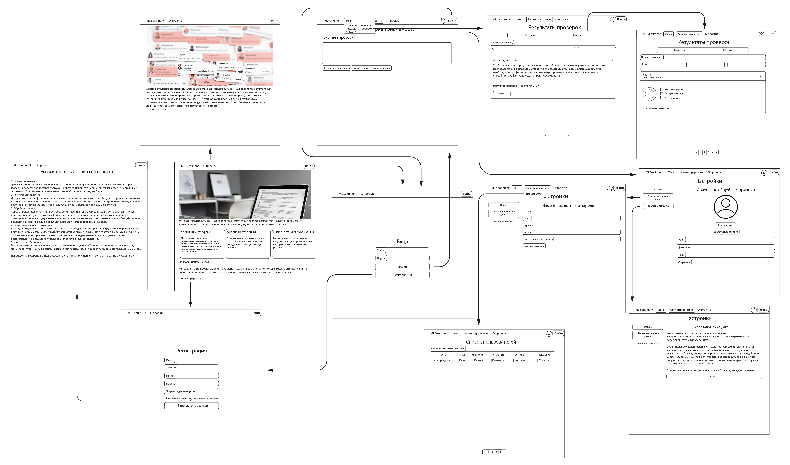

Документация
----

### Интерфейс веб-приложения




### Описание работы пользовательского интерфейса

- /registration - можно пройти регистрацию
- /login - вход по логину и паролю в приложение
- /account - страница где можно изменить информацию о пользователе
- /ml_check - можно проверить тональность, как отдельного текста, так и таблицы
- /inspection_results - просмотр результатов проверок
- /admin - изменение информации о пользователях и их удаление
- /about - описание проекта
- / - главная страница проекта

### Описание работы модели нейронной сети

 - ```/``` - запрос информации о сервере
 - ```/predict``` - обработка моделью одного текста (запрос: json={'text': '...'})
 - ```/predict_table``` - обработка моделью таблицы (в ней должна быть одна колонка с текстами)

### Описание работы веб сервиса

- /api/login - запрос на вход
- /api/logout - деаутентификация пользователя
- /api/registration - регистрация нового пользователя
- /api/user/ - получение информации о пользователе
- /api/user/avatar - получение фото профиля пользователя
- /api/user/avatar/update - обновление фото профиля пользователя
- /api/user/avatar/delete - удаление фото профиля пользователя
- /api/user/update - обновление информации о пользователе
- /api/user/change_password - изменение пароля
- /api/user/delete_account - удаление аккаунта
- /api/history - получение истории проверок 
- /api/history/length - количество проверок
- /api/history/file - скачивание файла из истории проверок
- /api/history/delete - удаление записи из истории проверок
- /api/admin/users - получение списка всех пользователей
- /api/admin/users/length - количество зарегистрированных пользователей
- /api/admin/users/create - создание нового пользователя
- /api/admin/users/update - обновление информации о пользователе
- /api/admin/users/delete - удаление пользователя
- /api/admin/users/activate - делает пользователя активным/не активным(не позволяет пользователю войти в аккаунт, сохраняя его данные)
- /api/ml/lstm/ - отправка текста для предсказания его тональности сетью LSTM
- /api/ml/lstm/table - отправка таблицы для предсказания тональностей сетью LSTM
- /api/version - получение версии сервера


